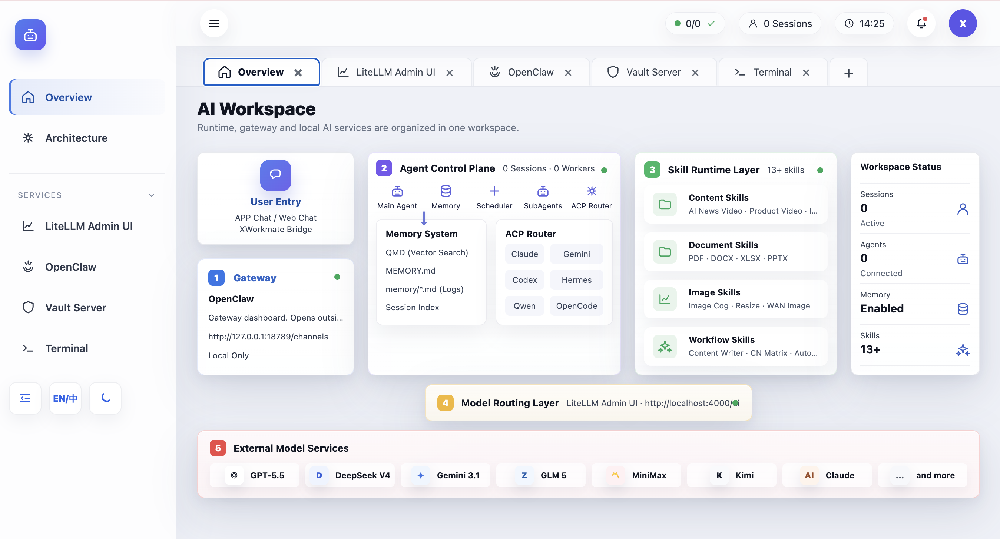

# XWorkspace Console

XWorkspace Console is the local AI workspace control plane for AI Workspace Lab. It brings together a React dashboard, Go status API, systemd user services, and XFCE desktop templates into one tabbed surface for services, runtime, terminal access, and workspace navigation.

## Preview



### Image / Video

Image and video workflows fit naturally as custom tabs inside the same console shell. This keeps artifact review, service switching, and runtime operations in one place instead of scattering them across separate apps.

## About

- Single entry point for the workspace UI at `http://127.0.0.1:17000`
- Tab-first console for Workspace, services, runtime, and embedded tools
- Designed to coordinate local AI services, gateway access, and desktop bootstrap flows
- Backed by `dashboard/`, `api/`, `config/`, `scripts/`, and `docs/`

## Start TLDR

1. Start the all-in-one installer:

```bash
curl -sfL https://raw.githubusercontent.com/ai-workspace-lab/xworkspace-console/main/scripts/setup-ai-workspace-all-in-one.sh | bash -
```

2. Or launch the local desktop console:

```bash
./scripts/setup-xworkspace-desktop.sh
```

3. Open the console:

```text
http://127.0.0.1:17000
```


## Download

- Latest source: [GitHub repository](https://github.com/ai-workspace-lab/xworkspace-console)
- Releases: [GitHub Releases](https://github.com/ai-workspace-lab/xworkspace-console/releases)
- Bootstrap script: `scripts/setup-ai-workspace-all-in-one.sh`
- Offline installer docs: [`docs/OFFLINE_AI_WORKSPACE_INSTALLER.md`](docs/OFFLINE_AI_WORKSPACE_INSTALLER.md)

## Docs / Links

- [`docs/REPOSITORY_OVERVIEW.md`](docs/REPOSITORY_OVERVIEW.md)
- [`docs/SETUP_AI_WORKSPACE_ALL_IN_ONE.md`](docs/SETUP_AI_WORKSPACE_ALL_IN_ONE.md)
- [`docs/OFFLINE_AI_WORKSPACE_INSTALLER.md`](docs/OFFLINE_AI_WORKSPACE_INSTALLER.md)
- [`docs/operations/service-port-plan.md`](docs/operations/service-port-plan.md)
- [`docs/designs/2026-06-07-ai-workspace-desktop-design.md`](docs/designs/2026-06-07-ai-workspace-desktop-design.md)
