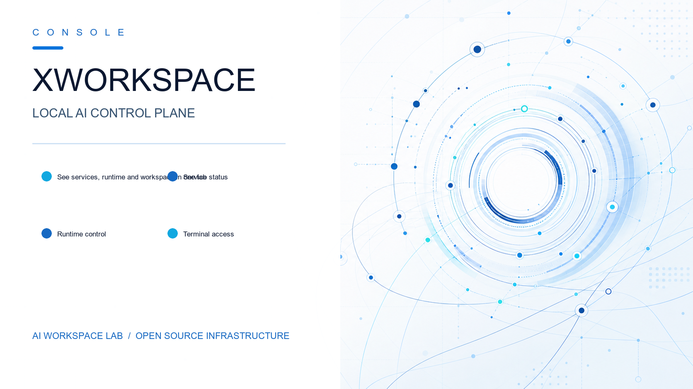

[](./LICENSE) [](https://react.dev/) [](https://go.dev/) [](./README.md)

[🇺🇸 English](README.md) | [🇨🇳 中文](README.zh.md)

# XWorkspace Console

XWorkspace Console is the local AI workspace control plane for AI Workspace Lab. It brings together a React dashboard, Go status API, systemd user services, and XFCE desktop templates into one tabbed surface for services, runtime, terminal access, and workspace navigation.

## Preview


## About

- Single entry point for the workspace UI at `http://127.0.0.1:17000`
- Tab-first console for Workspace, services, runtime, and embedded tools
- Designed to coordinate local AI services, gateway access, and desktop bootstrap flows
- Backed by `dashboard/`, `api/`, `config/`, `scripts/`, and `docs/`
- The all-in-one installer now also deploys [X-Memory-Hub](https://github.com/ai-workspace-lab/X-Memory-Hub) (development version, tracks `main`) by default — a PostgreSQL-first, MCP-compatible memory hub at `http://127.0.0.1:8790`, reusing the suite's PostgreSQL (pgvector + pg_jieba) and LiteLLM gateway for embeddings

## Start TLDR

> **Note:** Currently supports **macOS**, **Debian**, and **Ubuntu**. Other systems are untested.

### Installation

1. Start the all-in-one installer:

```bash
curl -sfL https://raw.githubusercontent.com/ai-workspace-lab/xworkspace-console/main/scripts/setup-ai-workspace-all-in-one.sh | bash -
```

2. Automatic model registration (via API Keys):

Exporting keys before running the installer automatically registers models (e.g., DeepSeek、NVIDIA NIM、Ollama Cloud) in the gateway:
```bash
export DEEPSEEK_API_KEY="sk-..."
export NVIDIA_API_KEY="nvapi-..."
export OLLAMA_API_KEY="your-key-here"

curl -sfL https://raw.githubusercontent.com/ai-workspace-lab/xworkspace-console/main/scripts/setup-ai-workspace-all-in-one.sh | bash -
```

3. Offline installation:

Use a pre-downloaded deployment package by specifying its file path:
```bash
export AI_WORKSPACE_OFFLINE_PACKAGE="/path/to/offline-package.tar.gz"
curl -sfL https://raw.githubusercontent.com/ai-workspace-lab/xworkspace-console/main/scripts/setup-ai-workspace-all-in-one.sh | bash -
```

### Uninstallation

```bash
# Standard uninstall (keeps configurations and states)
curl -sfL https://raw.githubusercontent.com/ai-workspace-lab/xworkspace-console/main/scripts/setup-ai-workspace-all-in-one.sh | bash -s -- uninstall

# Purge (removes all data, keys, and configurations)
curl -sfL https://raw.githubusercontent.com/ai-workspace-lab/xworkspace-console/main/scripts/setup-ai-workspace-all-in-one.sh | bash -s -- uninstall --purge
```

### Usage

1. Open the console via your browser:

```text
http://127.0.0.1:17000
```

2. Or launch the local desktop console application:

```bash
./scripts/setup-xworkspace-desktop.sh
```

## Download

- Latest source: [GitHub repository](https://github.com/ai-workspace-lab/xworkspace-console)
- Releases: [GitHub Releases](https://github.com/ai-workspace-lab/xworkspace-console/releases)
- Bootstrap script: `scripts/setup-ai-workspace-all-in-one.sh`
- Offline installer docs: [`docs/en/OFFLINE_AI_WORKSPACE_INSTALLER.md`](docs/en/OFFLINE_AI_WORKSPACE_INSTALLER.md)

## Docs / Links

- [`docs/en/FEATURES.md`](docs/en/FEATURES.md)
- [`docs/en/VERSION_MATRIX.md`](docs/en/VERSION_MATRIX.md)
- [`docs/en/REPOSITORY_OVERVIEW.md`](docs/en/REPOSITORY_OVERVIEW.md)
- [`docs/en/SETUP_AI_WORKSPACE_ALL_IN_ONE.md`](docs/en/SETUP_AI_WORKSPACE_ALL_IN_ONE.md)
- [`docs/en/OFFLINE_AI_WORKSPACE_INSTALLER.md`](docs/en/OFFLINE_AI_WORKSPACE_INSTALLER.md)
- [`docs/en/operations/service-port-plan.md`](docs/en/operations/service-port-plan.md)
- [`docs/en/designs/2026-06-07-ai-workspace-desktop-design.md`](docs/en/designs/2026-06-07-ai-workspace-desktop-design.md)
